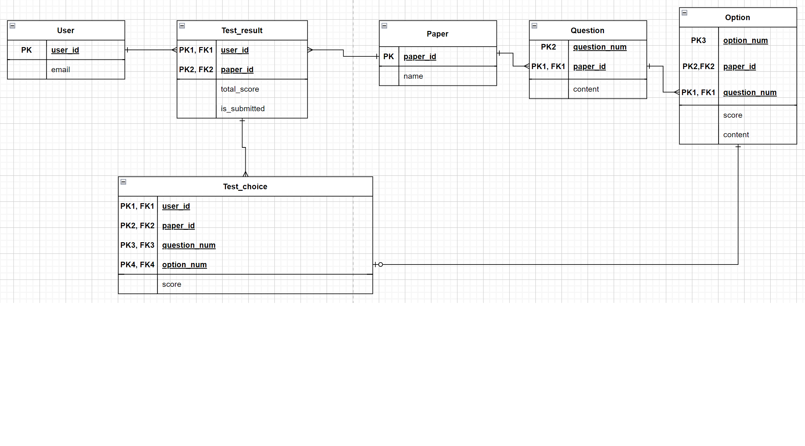

## Title

Maumlab assignment

## Description

### Application purpose

* 중복응답이 가능한 설문지 작성

### Technologies
* TypeScript
* NestJS
* GraphQL
* TypeORM
* PostgreSQL
* Apollo Server

### Constraints
* 한 설문지의 문제 갯수는 최대 100개로 제한
* 한 문제의 문항갯수는 최대 10개로 제한

### Details
* http://localhost:4000/에서 구동
* GraphQL Playground환경으로 가려면 http://localhost:4000/graphql 로 이동 필요
* 개발 편의를 위해 synchronize: true

## DB
### ERD


### Description
* User
    * 사용자 정보
    * PK: user_id
* Paper
    * 설문지 정보
    * PK: paper_id
* Question
    * 설문지의 질문 정보
    * PK: question_num + paper_id
    * 한 개의 설문지에는 여러개의 질문이 있으므로 Paper : Question = 1 : N. 그러나 한 개의 설문지에서 동일한 질문을 하면 안되므로 Question_num과 Paper_id를 Composite Key로 구성
    * question_num은 설문지 작성자가 수동으로 입력. 각 설문에서 질문번호 의미. 
* Option
    * 설문지의 질문의 문항 정보
    * PK: option_num + paper_id + question_num
    * 한 개의 질문에는 여러개의 문항이 있으므로 Question : Option = 1 : N. 그러나 한 개의 질문에 동일한 문항이 나오면 안되므로 question_num과 option_num을 Compoite Key로 구성하고 한 개의 설문지에 동일한 질문과 문항이 반복되면 안되므로 Composite Key에 paper_id 추가. 
    * option_num은 설문지 작성자가 수동으로 입력. 각 질문에서 문항번호 의미.
* Test_result
    * 사용자의 설문에 대한 결과 정보
    * PK: user_id + paper_id
    * 한 명의 사용자가 여러개의 다른 설문을 할 수 있으므로 User : Paper = 1: N. 그러나 동일한 설문은 두 번 이상 못하는게 일반적이므로  UserId와 PaperId를 Composite Key로 구성
* Test_choice
    * 사용자가 설문의 각 질문에 대해 어떤 문항을 선택했는지에 대한 정보
    * PK: user_id + paper_id + question_num + option_num
    * 한 개의 설문지에서 유저는 여러개의 질문에 대한 답을 해야하므로 Test_result : Test_choices = 1: N. User가 설문지의 각 질문에 대해 모든 문항에 반드시 체크해야 되는건 아니기 때문에 Test_choice : Option = 0 or 1 : 1. 한 명의 사용자가 수행한 설문에서 각 질문에 어떤 문항을 선택했냐에 대한 값을 담고있기 때문에 user_id, paper_id, question_id를 Composite Key로 가지며 한 질문에 대해 중복선택이 가능하므로 option_num을 Composite Key에 추가


## Installation

```bash
$ npm install
```

## Running the app

```bash
$ npm run start

```
